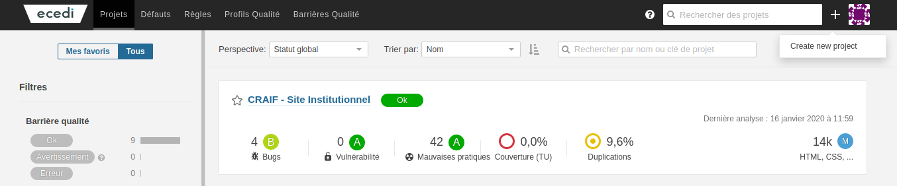
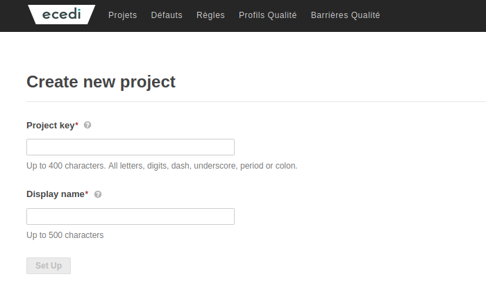

#SonarQube
https://www.sonarqube.org/

## Prerequis
Il faut créer un projet SonarQube associé dans https://sonar.ecedi.net
- se connecter sur ce site avec son compte gitlab

- créer un nouveau projet


## Configuration
- Copier le ficher sonar-project.properties.dist dans sonar-project.properties
- Renseigner les valeurs relatives à votre projet
```
# Required metadata
sonar.projectKey={la clé de votre projet SonarQube}
sonar.projectName={le nom de votre projet SonarQube}
sonar.projectVersion=1.0

# Comma-separated paths to directories with sources (required)
sonar.sources=src
sonar.exclusions=src/Migrations/*

# Encoding of the source files
sonar.sourceEncoding=UTF-8

sonar.host.url=https://sonar.ecedi.net
sonar.login={le login de votre projet SonarQube)

# Gitlab project
sonar.gitlab.project_id={l'url de votre projet dans gitlab}
sonar.scm.provider=git

sonar.branch.name=${CI_COMMIT_REF_SLUG}
```

## Lancement des audits
### Dans gitlab.ci
Prévoir une étape "quality"
```
stages:
    - ...
    - quality
    - ...
    - deploy

```
Brancher un audit sur toutes les branches de travail (features, bugfix, ...)
```
sonarqube_issues:
    image: ciricihq/gitlab-sonar-scanner
    stage: quality
    variables:
        SONAR_URL: https://sonar.ecedi.net
        SONAR_ANALYSIS_MODE: issues
    script:
        - gitlab-sonar-scanner -Dsonar.gitlab.commit_sha=$CI_COMMIT_SHA -Dsonar.gitlab.ref_name=$CI_COMMIT_REF_NAME
    allow_failure: true
    # dependencies:
    #     - test-e2e
    tags:
        - smp-runner-docker
    only:
        - branches
    except:
        refs:
            - dev
            - staging
            - master
```
Publier un audit à chaque modification des branches dev et staging
```
sonarqube_publish:
    image: ciricihq/gitlab-sonar-scanner
    stage: quality
    only:
        - master
        - staging
    variables:
        SONAR_URL: https://sonar.ecedi.net
        SONAR_ANALYSIS_MODE: publish
    script:
        - gitlab-sonar-scanner
    tags:
        - smp-runner-docker
```
